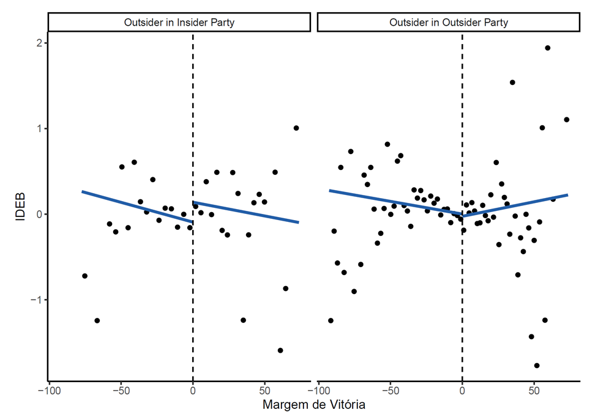

```{r setup, include=FALSE}
knitr::opts_chunk$set(echo = TRUE)
library(knitr)
```

<center>

## Good Governance in Poor Places: <br>Why Outsider Leaders Fight their own Party Machine

</center>

<br> 

What motivated Governor Sule Lamido to introduce a sweeping governance reform in Jigawa state, Nigeria, despite a deep-rooted history of clientelist practices and the state's pervasive poverty? Why did Governors Tasso Jereisatti in Ceará, Brazil, and Nitish Kumar in Bihar, India, abandon clientelism in similarly unlikely circumstances?

```{r, out.width="600px", out.extra='style="float:right; padding:30px"', echo=F}

```


This book manuscript argues that these leaders introduced programmatic governance reform to out-compete clientelist elites *in their own political party*. Rather than responding to socioeconomic change as the literature on modernization suggests, and rather than being constrained by disciplined parties, as the institutionalist literature proposes, the evidence I bring to bear demonstrates that these reformers were working against the grain of voter expectations and party practices, seeking to undermine their own party's political machine. This was politically rewarding because these reformers were *outsiders* from dominant clientelist networks, so they had little to lose from attaching clientelism, and plenty to gain from harming the networks of their rivals.  

Drawing together diverse threads of evidence from a range of methodologies, including a formal model, crossnational subnational comparisons, process tracing and close-election regression discontinuities, the book documents the remarkable frequency with which subnational politicians attempt risky reforms in adverse contexts and traces the roots of these reform strategies to intra-party competition. Additional evidence from survey experiments and geographic discontinuities highlights the circumstances in which this reform opening can be transformed into a sustained transformation in governing norms and voter demands. 

```{r, out.width="600px", out.extra='style="float:left; padding:30px"', echo=F}

```

The argument highlights a previously unrecognized route to better governance for millions of citizens in the poorest parts of emerging federal democracies, and suggests new tools and strategies for external actors to support reform. 
